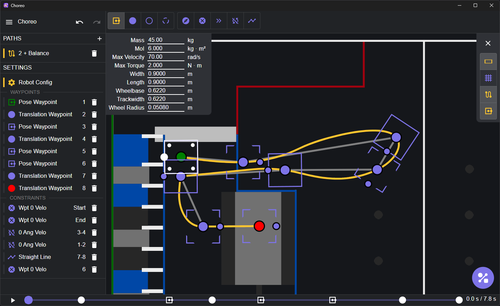

# Choreo

Choreo (_Constraint-Honoring Omnidirectional Route Editor and Optimizer_, pronounced like choreography) is a graphical tool for planning time-optimized trajectories for autonomous mobile robots in the FIRST Robotics Competition.

## Download and Install

Grab the latest release for your platform on the [releases](https://github.com/SleipnirGroup/Choreo/releases) page.

To run development versions of Choreo check [the wiki](https://github.com/SleipnirGroup/Choreo/wiki/Building-Choreo)

## Robot code integration

An example project using Choreo is available [here](https://github.com/SleipnirGroup/ChoreoSwerveBot).

## Physical input parameters

The trajectory optimizer depends upon the following user-specificed parameters, which are entered in the Robot Configuration panel.

- **Mass** [kg]: The mass of the robot with battery and bumpers
- **MoI** [kg * m2]: The resistance to change in rotational velocity in response to a torque applied to the robot about the vertical axis
- **Max Velocity** [m/s]: The maximum tangential speed of the wheel
  - Note: A reasonable choice of Max Velocity is that corresponding to ~80% of free speed experienced at the drive motor(s)
- **Max Torque** [N * m]: The maximum torque applied at the wheel
  - Note: A reasonable choice of Max Torque is that corresponding to a current draw of approximately `1.5 * BreakerValue` experienced at the drive motor(s)
- **Wheelbase** and **Trackwidth** [m]: The largest distances between the robot's wheel centers
- **Length** and **Width** [m]: The overall size of the robot's _bumper_

### Measuring moment of intertia

The robot's rotational inertia has a significant impact on how quickly it can follow complex paths. For the best results, it is recommended to get as accurate an estimate of this parameter as possible. This can be accomplished via:

- Faithful CAD loaded with mass properties
- Physical experimentation
- System Identification methods

If none of these techniques are possible, a reasonable estimate of MoI would be `mass * length * width / 6` based on the assumption of a rectangle of uniformly-distributed mass.

## Authors

