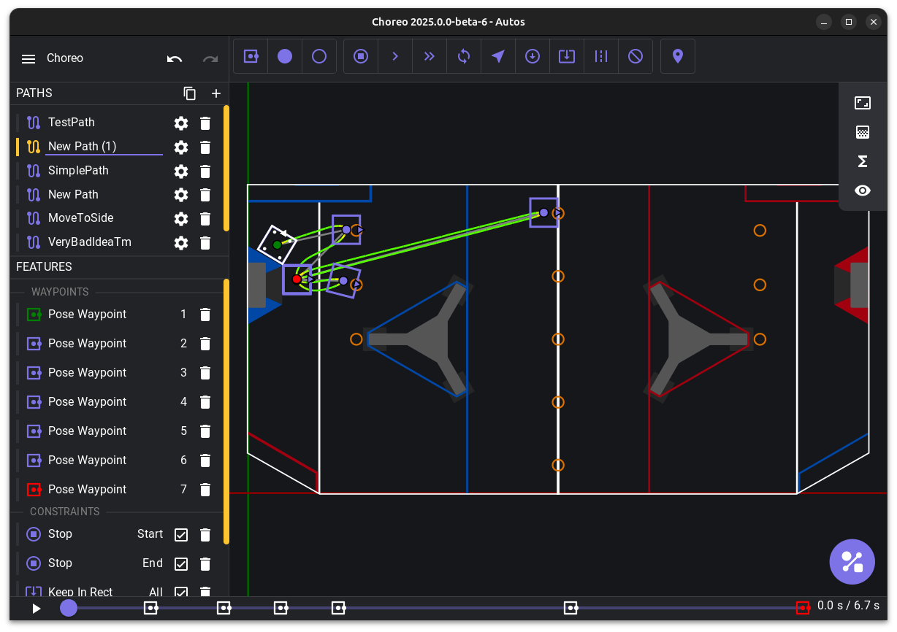

# Choreo

Choreo (_Constraint-Honoring Omnidirectional Route Editor and Optimizer_, pronounced like choreography) is a graphical tool for planning time-optimized trajectories for autonomous mobile robots in the FIRST Robotics Competition.

## Download and Install

Grab the latest release for your platform on the [releases](https://github.com/SleipnirGroup/Choreo/releases) page.

## Usage and Documentation

Check out the [Docs](https://sleipnirgroup.github.io/Choreo), which covers installation, usage, building, and ChoreoLib.

## Robot code integration

An example project using Choreo is available [here](https://github.com/SleipnirGroup/ChoreoSwerveBot).

## Repository directory structure

- [src](src) - Choreo frontend
- [src-tauri](src-tauri) - Choreo backend
- [choreolib](choreolib) - ChoreoLib: robot-side library for loading and following Choreo paths
- [trajoptlib](trajoptlib) - TrajoptLib: library used by Choreo to generate time-optimal trajectories for FRC robots

## Authors

The 2024 field background was traced from the field renders provided by [MikLast](https://www.chiefdelphi.com/t/2024-crescendo-top-down-field-renders/447764).
