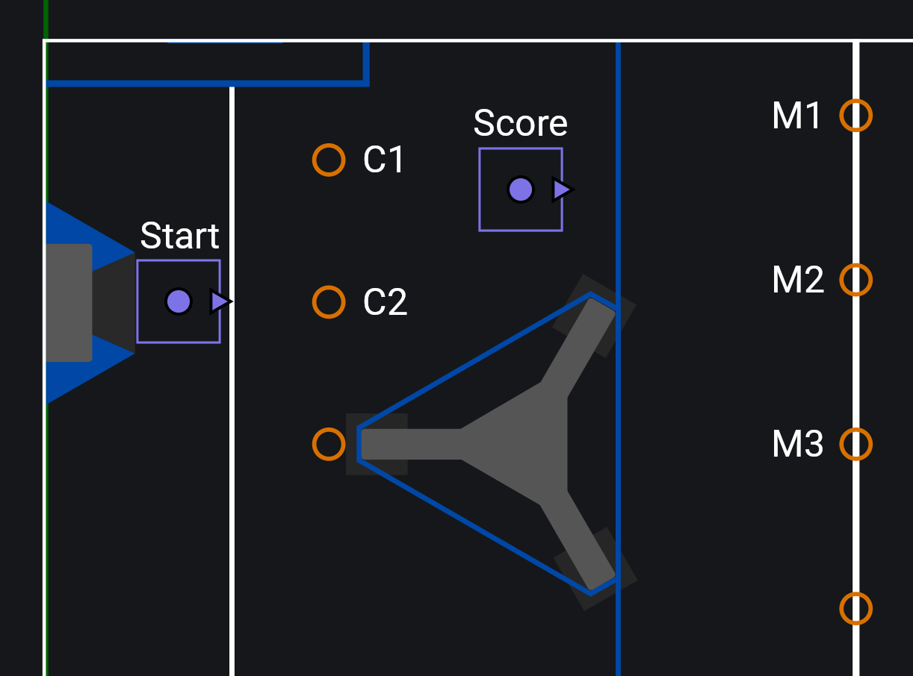

# AutoFactory (Java Only)

!!! note
    This API is only available for Java. C++ and Python users should instead utilize the [Trajectory API](./trajectory-api.md).

ChoreoLib provides the `AutoFactory` ([Java](/api/choreolib/java/choreo/auto/AutoFactory.html)) class as a higher level API to make it easier to create complex auto routines inside your robot code.

```java title="Robot.java"
public class Robot extends TimedRobot {
    private final Drive driveSubsystem = new Drive();
    private final AutoFactory autoFactory;

    public Robot() {
        autoFactory = new AutoFactory(
            driveSubsystem::getPose, // A function that returns the current robot pose
            driveSubsystem::resetOdometry, // A function that resets the current robot pose to the provided Pose2d
            driveSubsystem::followTrajectory, // The drive subsystem trajectory follower (1)
            true, // If alliance flipping should be enabled (2)
            driveSubsystem, // The drive subsystem
        );
    }
}
```

1. See [Getting Started](./getting-started.md/#setting-up-the-drive-subsystem) for more details on how to implement a trajectory follower in your drive subsystem.
2. It is recommended for trajectories to be created only on the blue side of the field in the Choreo application. Enabling alliance flipping will automatically mirror trajectories to the red side of the field if the robot is on the red alliance.

!!! tip
    It is recommended for your `AutoFactory` to be created at the Robot scope (e.g. in the `Robot` or `RobotContainer` constructor), not in the drive subsystem. Some teams may opt to create a separate class (ex `Autos.java`) that is given the robot's subsystems, and contains all code relevant to constructing autonomous routines.

There are two ways to create autos with an `AutoFactory`: [command compositions](#using-command-compositions) or the [`AutoRoutine`](#using-autoroutine) class. For short and simple autos, command compositions may be the best choice for you. However, if your auto includes many segments, complex logic, or branching behavior, utilizing `AutoRoutine` is likely the best option.

!!! note
    The following examples use "segmented" trajectories: multiple reusable small trajectories that can be combined to create an entire autonomous sequence. You may be used to the more traditional approach of "monolithic" trajectories, which is a single trajectory that spans the entire autonomous period, running from start to finish without stopping.

    Monolithic trajectories may be more cumbersome in some scenarios (*especially* for branching autos), and you may find it more difficult to inject logic in-between points of interest along a trajectory.

    With this in mind, if you don't plan on creating branching autos you can still achieve segmented trajectory behavior with a monolithic trajectory by using the "Split" checkbox on a waypoint in the Choreo application. Overloads for trajectory related methods provide an argument to define the index of these splits to fetch a trajectory segment from.

## Using Command Compositions

Command compositions is how most teams architect their autonomous routines. Typically a single `Commands.sequence()` (1), with a list of commands that define a sequential list of actions for your robot to execute during the autonomous period.
{ .annotate }

1. Your team may use a `SequentialCommandGroup` subclass

The `AutoFactory` class provides the `trajectoryCmd()` method, which creates a command that will follow the specified trajectory.

```java
// Follows deploy/choreo/myTrajectory.traj
Command myTrajectory = autoFactory.trajectoryCmd("myTrajectory");
```

!!! warning
    Trajectories are sampled using a timer, which also dictates when the command ends. This means that your robot is technically not guaranteed to finish exactly at the end of a trajectory. Properly tuning your robot's drivetrain as well as feedback gains in your trajectory follower will mitigate this error.

You can then combine trajectory commands with other functions of your robot to create an autonomous routine. For more information about command compositions, check out [WPILib's documentation](https://docs.wpilib.org/en/stable/docs/software/commandbased/command-compositions.html).

```java
public Command pickupAndScoreAuto() {
    return Commands.sequence(
        autoFactory.resetOdometry("pickupGamepiece"), // (1)
        Commands.deadline(
            autoFactory.trajectoryCmd("pickupGamepiece"),
            intakeSubsystem.intake() // (2)
        ),
        Commands.parallel(
            autoFactory.trajectoryCmd("scoreGamepiece"),
            scoringSubsystem.getReady()
        )
        scoringSubsystem.score()
    );
}
```

1. You should always reset your robot's odometry to the start of the first trajectory being followed in an autonomous routine. `AutoFactory.resetOdometry()` will accomplish this, setting the robot's pose to the start of the specified trajectory.

    Advanced users may use vision to get the robot's starting position, however this is not recommended for most teams.

2. Throughout this documentation, we assume you are using [command factory methods](https://docs.wpilib.org/en/stable/docs/software/commandbased/organizing-command-based.html#instance-command-factory-methods) in your subsystems, which is a more concise alternative to command classes (i.e. `new IntakeCommand()`).

## Using AutoRoutine

While command compositions may be an effective architecture in many cases, it has a tendency to become unwieldy if your autonomous routine has branches, if your subsystems use default commands, or if you want your subsystems to run independently and "hand off" actions to each other. The `AutoRoutine` ([Java](/api/choreolib/java/choreo/auto/AutoRoutine.html)) class aims to solve these problems, using WPILib's [`Trigger`](https://docs.wpilib.org/en/stable/docs/software/commandbased/binding-commands-to-triggers.html) class to define a control flow based on reactions to state that don't require subsystems until they are needed.

To get started, create a new routine using `AutoFactory.newRoutine()`:

```java
// Creates a new routine with the name "exampleRoutine"
AutoRoutine routine = autoFactory.newRoutine("exampleRoutine");
```

The "entrance" to all routines is the `AutoRoutine.active()` trigger. You should bind the first command you want to execute to this trigger.

```java
routine.active().onTrue(Commands.print("Started the routine!"));
```

Trajectories can be loaded using `AutoRoutine.trajectory()`, which will return an `AutoTrajectory` ([Java](/api/choreolib/java/choreo/auto/AutoTrajectory.html)). The `AutoTrajectory` class exposes multiple triggers for you to attach reactive logic to, as well as `AutoTrajectory.cmd()` for scheduling the trajectory.

```java
public AutoRoutine pickupAndScoreAuto() {
    AutoRoutine routine = autoFactory.newRoutine("taxi");

    // Load the routine's trajectories
    AutoTrajectory driveToMiddle = routine.trajectory("driveToMiddle");

    // When the routine begins, reset odometry and start the first trajectory (1)
    routine.active().onTrue(
        Commands.sequence(
            driveToMiddle.resetOdometry(),
            driveToMiddle.cmd()
        )
    );

    return routine;
}
```

AuoTrajectories have a variety of triggers that can be used to attach logic to the trajectory, these include:

- `active()` - Triggered when the trajectory is active
- `inactive()` - Triggered when the trajectory is inactive, equivalent to `active().negate()`
- `atTime(String)` / `atTime(double)` - Triggered when the trajectory reaches a specific time based on a value or event marker
- `atPose(String, double, double)` / `atPose(Pose2d, double, double)` - Triggered when the robot reaches a specific pose based on a value or event marker
- `done()` - Triggered for 1 cycle after the trajectory is finished
- `doneDelayed(int)` - Triggered for 1 cycle `n` cycles after the trajectory is finished
- `doneFor(int)` - Triggered for `n` cycles after the trajectory is finished
- `recentlyDone()` - Triggered after the trajectory is finished until another trajectory is started

```java
public AutoRoutine pickupAndScoreAuto() {
    AutoRoutine routine = autoFactory.newRoutine("pickupAndScore");

    // Load the routine's trajectories
    AutoTrajectory pickupTraj = routine.trajectory("pickupGamepiece");
    AutoTrajectory scoreTraj = routine.trajectory("scoreGamepiece");

    // When the routine begins, reset odometry and start the first trajectory (1)
    routine.active().onTrue(
        Commands.sequence(
            pickupTraj.resetOdometry(),
            pickupTraj.cmd()
        )
    );

    // Starting at the event marker named "intake", run the intake (2)
    pickupTraj.atTime("intake").onTrue(intakeSubsystem.intake());

    // When the trajectory is done, start the next trajectory
    pickupTraj.done().onTrue(scoreTraj.cmd());

    // While the trajectory is active, prepare the scoring subsystem
    scoreTraj.active().whileTrue(scoringSubsystem.getReady());

    // When the trajectory is done, score
    scoreTraj.done().onTrue(scoringSubsystem.score());

    return routine;
}
```

1. You should always reset your robot's odometry to the start of the first trajectory being followed in an autonomous routine. `AutoTrajectory.resetOdometry()` will accomplish this, setting the robot's pose to the start of the specified trajectory.

    Advanced users may use vision to get the robot's starting position, however this is not recommended for most teams.

2. Alternatively, you can use `AutoTrajectory.atPose()` for utilizing event markers. See the [Java reference documentation](/api/choreolib/java/choreo/auto/AutoTrajectory.html#atPose(java.lang.String,double,double)) for more information about behavior.

!!! warning
    The `AutoTrajectory.done()` trigger is only `true` for one cycle of the command scheduler after the trajectory is finished, meaning that using bindings such as `Trigger.whileTrue()` may not produce the desired behavior. Instead, use bindings such as `Trigger.onTrue()`.

Traditional triggers can also be used in conjunction with an auto routine. However, they will experience "hygiene" issues if not used correctly, causing them to be active even when the routine is not. You must either:

- Use `AutoRoutine.observe()` to ensure the trigger is only active when the routine is active
- Conjoin a trigger to one created by `AutoRoutine` or `AutoTrajectory`

```java
Trigger myTrigger = new Trigger(() -> condition);

// Safe
routine.observe(myTrigger).onTrue(Commands.print("Foo"));
routine.active().and(myTrigger).onTrue(Commands.print("Bar"));

// Unsafe
myTrigger.onTrue(Commands.print("Foo"));
myTrigger.and(routine.active()).onTrue(Commands.print("Bar"));
```

Sometimes, you may want to implement a "branching auto": an autonomous routine that changes behavior based on the state of the robot. An excellent example for the need of branching autos is the [2024 season](https://youtu.be/9keeDyFxzY4), where robots would race to the midline to grab a gamepiece. If another robot beat yours to the midline, or your robot missed a game piece, a common strategy was to go directly to the next gamepiece on the midline, instead of coming back to score. As an example, [this match](https://youtu.be/_gcezRaGP5A?t=6) from the 2024 championship shows both 254 and 3339 running branching autos.

Below is an example auto routine from the 2024 season, taking advantage of the `AutoRoutine` paradigm:

!!! note
    Be careful when using `Commands.either()` to achieve branching behavior. The resulting composition will require subsystems from both the `onTrue` and `onFalse` commands, which may block default commands that would otherwise be expected to run. As shown in the example below, chaining triggers is the recommended pattern for creating a branching auto.

```java
public AutoRoutine branching2024Auto() {
    AutoRoutine routine = autoFactory.newRoutine("branching2024Auto");

    // This routine uses segments between pre-defined handoff points.
    // Expand the tooltip for information about their naming convention -> (1)

    // Load the routine's trajectories
    AutoTrajectory startToC2 = routine.trajectory("startToC2");
    AutoTrajectory C2toM1 = routine.trajectory("C2toM1");
    AutoTrajectory M1toM2 = routine.trajectory("M1toM2");
    AutoTrajectory M2toM3 = routine.trajectory("M2toM3");
    AutoTrajectory M1toScore = routine.trajectory("M1toScore");
    AutoTrajectory M2toScore = routine.trajectory("M2toScore");
    AutoTrajectory M3toScore = routine.trajectory("M3toScore");
    AutoTrajectory scoreToM2 = routine.trajectory("scoreToM2");
    AutoTrajectory scoreToM3 = routine.trajectory("scoreToM3");

    // When the routine starts, reset odometry, shoot the first gamepiece, then go to the "C2" location
    routine.active().onTrue(
        Commands.sequence(
            startToC2.resetOdometry(),
            shooterSubsystem.shoot(),
            startToC2.cmd()
        )
    );

    // Pick up and shoot the gamepiece at the "C2" location, then go to the "M1" location
    startToC2.active().whileTrue(intakeSubsystem.intake());
    startToC2.done().onTrue(shooterSubsystem.shoot().andThen(C2toM1.cmd()));

    // Run the intake when we are approaching a gamepiece
    routine.anyActive(C2toM1, scoreToM2, scoreToM3, M1toM2, M2toM3) // (2)
        .whileTrue(intakeSubsystem.intake());

    // If we picked up the gamepiece, go score, then go to the next midline location
    // If we didn't pick up the gamepiece, go directly to the next midline location

    // M1
    Trigger atM1 = C2toM1.done();
    atM1.and(shooterSubsystem::noGamepiece).onTrue(M1toM2.cmd());
    atM1.and(shooterSubsystem::hasGamepiece).onTrue(M1toScore.cmd());
    M1toScore.done().onTrue(shooterSubsystem.shoot().andThen(scoreToM2.cmd()));

    // M2
    Trigger atM2 = routine.anyDone(scoreToM2, M1toM2); // (3)
    atM2.and(shooterSubsystem::noGamepiece).onTrue(M2toM3.cmd());
    atM2.and(shooterSubsystem::hasGamepiece).onTrue(M2toScore.cmd());
    M2toScore.done().onTrue(shooterSubsystem.shoot().andThen(scoreToM3.cmd()));

    // M3
    Trigger atM3 = routine.anyDone(scoreToM3, M2toM3);
    atM3.and(shooterSubsystem::hasGamepiece).onTrue(M3toScore.cmd());
    M3toScore.done().onTrue(shooterSubsystem.shoot());

    return routine;
}
```

1. 
2. `AutoRoutine.anyActive()` can be used as a shorthand for checking if any trajectories in a set are active.
3. Similar to `AutoRoutine.anyActive()`, `AutoRoutine.anyDone()` can be used as a shorthand for checking if any trajectories in a set are done.

## Auto Bindings

Auto bindings are used to bind event markers in trajectories made by the `AutoFactory` to commands. Commands added to the `AutoFactory` using `bind` exhibit the same behavior as those bound to `AutoTrajectory.atTime(String)`, except they are applied globally across all routines. This is useful if you have simpler actions that you want to trigger in any trajectory without much thought.

!!! warning
    Even if a marker is bound individually in an `AutoTrajectory.atTime(String)` trigger, the global binding will still run, and cannot be disabled for a single marker.

```java
autoFactory
    .bind("intake", intakeSubsystem.intake())
    .bind("score", scoringSubsystem.score());
```

## AutoChooser

The `AutoChooser` ([Java](/api/choreolib/java/choreo/auto/AutoChooser.html)) class allows you to send a list of your autonomous routines to a driver dashboard for selection before a match. It is meant to be a more efficient alternative to `SendableChooser`, taking a [lazy loading](https://en.wikipedia.org/wiki/Lazy_loading) approach to generating command compositions or an `AutoRoutine`. This approach has the benefit of not loading all autos on startup, but also not loading the auto after the match starts, which may cause a delay when using many or large trajectories.

!!! tip
    Due to its performance implications and support for `AutoRoutine`, using `AutoChooser` is the recommended pattern for auto selection, instead of `SendableChooser` or other alternatives.

```java title="Robot.java"
public class Robot extends TimedRobot {
    private final AutoFactory autoFactory;
    private final AutoChooser autoChooser;

    public Robot() {
        // Other robot initialization code
        // ...

        // Create the auto chooser
        autoChooser = new AutoChooser();

        // Add options to the chooser
        autoChooser.addRoutine("Example Routine", this::exampleRoutine);
        autoChooser.addCmd("Example Auto Command", this::exampleAutoCommand);

        // Put the auto chooser on the dashboard
        SmartDashboard.putData(autoChooser);

        // Schedule the selected auto during the autonomous period
        RobotModeTriggers.autonomous().whileTrue(autoChooser.selectedCommandScheduler());
    }

    private AutoRoutine exampleRoutine() {
        // ...
    }

    private Command exampleAutoCommand() {
        // ...
    }
}
```
