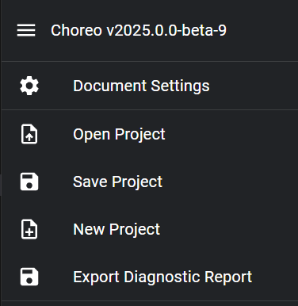

# Document Settings

The Document Settings panel allows you to configure several document-wide settings. Access the Document Settings panel
by clicking "Document Settings" in Choreo's main menu.

See the pages below for explanations of each tab in the Document Settings panel.

[Robot Configuration](./document-settings/robot-configuration.md)

[File Export Settings](./document-settings/file-export-settings.md)
