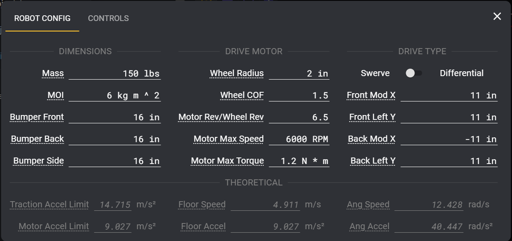

## Start by downloading Choreo from **[Releases](https://github.com/SleipnirGroup/Choreo/releases)**

## Robot Config

The trajectory optimizer depends upon the following user-specified parameters, which are entered in the Robot Configuration panel. This helps the optimizer understand the robot's projected path very accurately.

Access the robot-config by accessing the drawer via hamburger icon on top left of screen, then clicking "Document Settings"

### Dimensions

- **Mass** [kg]: The mass of the robot with battery and bumpers
- **MoI** [kg * m2]: The resistance to change in rotational velocity in response to a torque applied to the robot about the vertical axis
- **Max Velocity** [m/s]: The maximum tangential speed of the wheel

!!! tip "How to measure Max Velocity"

    A reasonable choice of Max Velocity is that corresponding to ~80% of free speed experienced at the drive motor(s).

- **Max Torque** [N * m]: The maximum torque applied at the wheel

!!! tip "How to measure Max Torque"

    A reasonable choice of Max Torque is that corresponding to a current draw of approximately `1.5 * BreakerValue` experienced at the drive motor(s).

- **Wheelbase and Trackwidth** [m]: The largest distances between the robot's wheel centers
- **Length and Width** [m]: The overall size of the robot's _bumper_.

!!! tip "Saving Robot Config"
    Saving a copy of the robotConfig somewhere safe, like the root of a robot project, is highly recommended. This is so you can correlate that robot project to your robot's specifications, and thus your paths.

!!! tip "Undo + Redo"
    Undo and Redo shortcuts work for all of these values.

### Measuring Moment of Inertia (MoI)

The robot's rotational inertia has a significant impact on how quickly it can follow complex paths. For the best results, it is recommended to get as accurate an estimate of this parameter as possible. This can be accomplished via:

- Faithful CAD loaded with mass properties
- Physical experimentation
- Other System Identification methods

If none of these techniques are possible, a reasonable estimate of MoI would be mass _ length _ width / 6 based on the assumption of a rectangle of uniformly-distributed mass.

!!! tip

    Of course, more precision is always better. But after ~3 decimals, you will most likely get diminishing returns.

### Drive Motor

For presets to these values, jump to [Motor Calculator](#motor-calculator)

### Theoretical

Calculated robot metrics for reference and validation.

- **Floor Speed** [m/s]: Linear Maximum speed when not rotating
- **Floor Accel** [m/s2]: Linear Maximum acceleration when not rotating
- **Ang Speed** [rad/s]: Maximum angular speed when spinning in place
- **Ang Accel** [rad/s2]: Maximum angular acceleration when spinning in place

### Motor Calculator

Choose from the following motor presets and a current limit in Amps.

In addition to modifying the above [Drive Motor](#drive-motor) values, it shows:

- **Preview Max Speed** [RPM]: Estimated speed under load (~80% of free speed)
- **Preview Max Torque** [N • m]: Motor torque at the given current limit

Motors Supported:

- Falcon 500
- Falcon with FOC
- NEO
- NEO Vortex
- Kraken X60
- Kraken with FOC
- CIM

!!! warning

    Make sure to press the APPLY button, or else your values will not save. Don't worry, you can always hit undo at any time to revert.