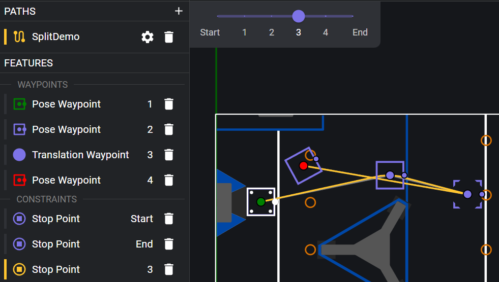
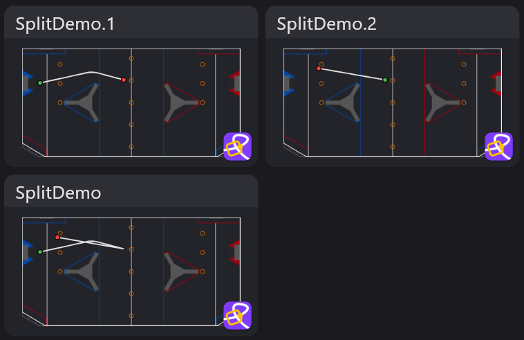

# File Export Settings

The Export Config panel in Document Settings allows you to modify how Choreo exports trajectories to the deploy directory
for use by your robot.

## Split Trajectories at Stop Points

> This configuration applies to all paths in the document.

The `Split .traj files at stop points` switch determines whether the `Stop Point` constraint on a waypoint
will also be used to split a Choreo path's generated trajectory into multiple `.traj` files. This allows you
to design one Choreo path for an entire autonomous routine, then load and follow the split parts of it individually
in your robot code's autonomous sequence.

Whether or not the switch is turned on, Choreo will export a `.traj` file containing the whole path, as `PathName.traj`.
When the switch is on, Choreo will also export the split parts as `PathName.1.traj, PathName.2.traj` etc. When the switch is turned off, Choreo will export the whole path as a second `.traj` file `PathName.1.traj`. This allows ChoreoLib's `Choreo.getTrajectoryGroup(String trajName)` (Java) and `Choreo::GetTrajectoryGroup(std::string_view trajName)` (C++) to work with projects that do not split at stop points.

This switch should also be turned on when using Choreo to generate paths for the PathPlanner GUI's auto builder. The individual segments will be visible in PathPlanner, and can be used separately when making autos.

