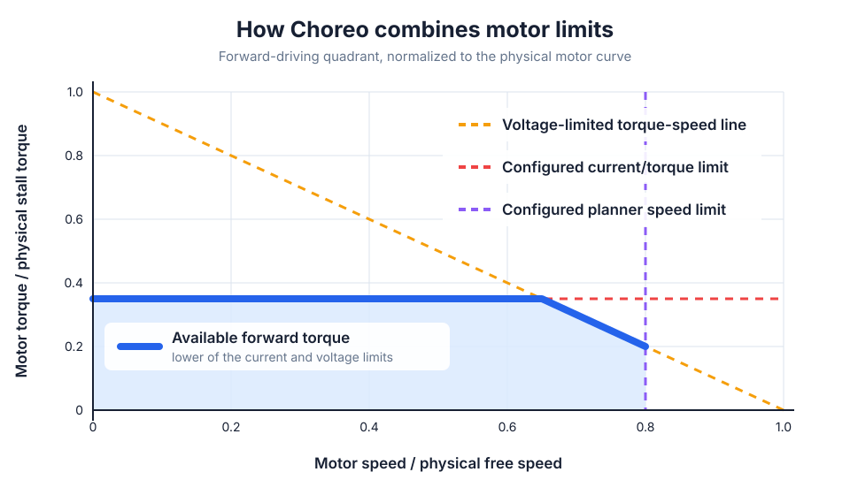
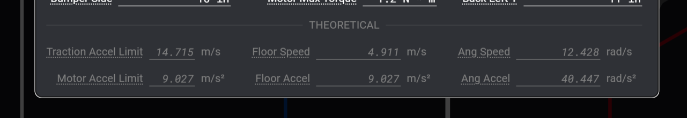

# Robot Configuration

The trajectory optimizer depends upon the following user-specified parameters, which are entered in the Robot Configuration panel. The more accurately you enter these parameters, the more confident you can be that your robot will follow the time-optimized trajectory on the first attempt.

!!! tip

    While more precision is always better, you'll most likely get diminishing returns after 3-4 significant figures.

!!! tip "Saving Robot Config"
    Saving a copy of the robot config somewhere safe, like the root of a robot project, is highly recommended. This is so you can correlate that robot project to your robot's specifications, and thus your paths.

!!! tip "Undo + Redo"
    Undo and Redo shortcuts work for all of these values.

## Dimensions

In this panel, enter some basic properties of your robot chassis.

- **Mass** $[kg]$: The mass of the robot with battery and bumpers
- **MoI** $[kg * m^2]$: The robot's moment of inertia, a measure of resistance to change in rotational velocity in response to a torque applied about the vertical axis
- **Bumper Width** and **Bumper Length** $[m]$: The overall size of the robot's bumper.
- **Wheelbase and Trackwidth** $[m]$: The largest distances between the robot's wheel centers

## Drive Motor

This panel asks for details about the drive motors used to propel the robot around the playing field.

### Geometric properties

- Wheel Radius $[m]$: The radius of the drive wheel
- Gearing (unitless): The ratio of $(\text{Drive motor rotations} / \text{Wheel rotations})$

### Motor performance properties

These values should be determined by consulting the motor's documentation.

- **Motor Speed Limit** $[\text{RPM}]$: The planner speed limit for each drive motor

!!! tip "Choosing a Motor Speed Limit"

    A reasonable Motor Speed Limit is ~80% of the free speed of the drive motor(s). Although your motors have more speed available, this headroom helps ensure that your robot is able to close any errors and return to the planned trajectory.

- **Motor Max Torque** $[N * m]$: The maximum torque applied by each drive motor

!!! tip "Choosing a Max Torque"

    A reasonable choice of Max Torque is that corresponding to a current draw of approximately `1.5 * BreakerValue` experienced at the drive motor(s). Although your motors have more torque available, this headroom helps ensure that your robot is able to close any errors and return to the planned trajectory. Use the motor's manual or published performance curves to determine an appropriate value.

- **Use torque-speed curve**: Limits the voltage required by the planned wheel torque and speed to the motor's nominal voltage. Leave this disabled only when preserving the behavior of a project created before this setting was available.
- **Motor Free Speed** $[\text{RPM}]$: The physical no-load motor speed at nominal voltage
- **Motor Stall Torque** $[N * m]$: The physical motor torque at zero speed and nominal voltage

The torque-speed curve is applied in addition to Motor Speed Limit and Motor Max Torque. Those existing values remain independent planning and current limits.

The current and planner limits in the diagram are illustrative. It shows the forward-driving quadrant; Choreo applies the signed voltage constraint in reverse and while braking as well.

## Theoretical

This panel displays calculated metrics about your robot, for reference and validation.

- **Traction Accel Limit**  $[m/s^2]$: The robot's maximum acceleration before wheels begin slipping
- **Motor Accel Limit** $[m/s^2]$: The robot's maximum acceleration based on motor torque
- **Floor Speed** $[m/s]$: The straight-line robot speed corresponding to the Motor Speed Limit
- **Floor Accel** $[m/s^2]$: The maximum acceleration reached by the robot when driving in a straight line and not rotating. The minimum of traction and motor limits.
- **Ang Speed** $[rad/s]$: The robot's maximum angular speed when spinning in place
- **Ang Accel** $[rad/s^2]$: The robot's maximum angular acceleration when spinning in place
