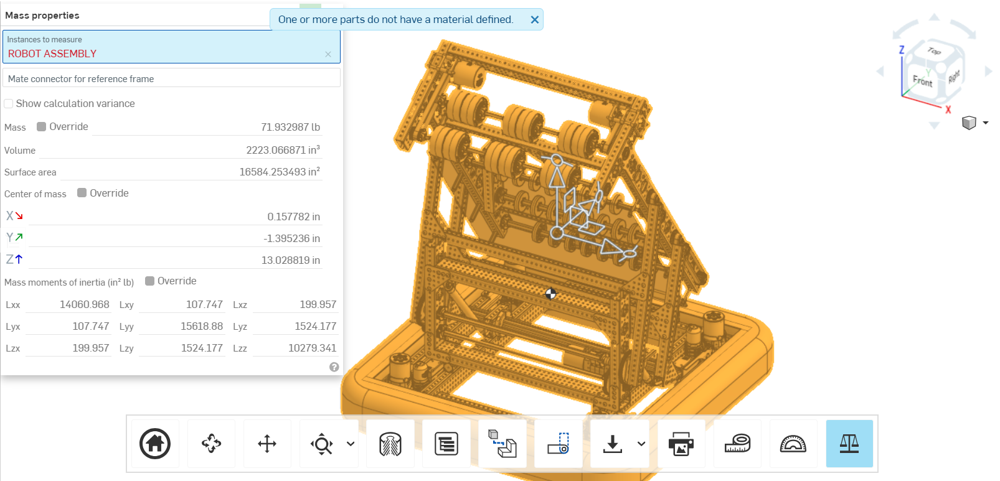
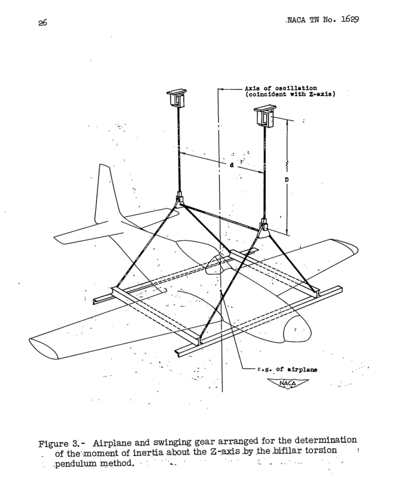

# Estimating and measuring Moment of Inertia (MoI)

The robot's rotational inertia has a significant impact on how quickly it can follow complex, twisty paths. For the best results, it is recommended to get as accurate an estimate of this parameter as possible.

In this section, we present various approaches to determine a resonably accurate estimate of this key property.

## Faithful CAD loaded with mass properties

Most popular CAD tools can calculate the mass properties of solid modeled objects. However, a disciplined approach to CAD work is required for these values to be accurate. 

Pictured: [2024 REV ION FRC Starter Bot](https://www.revrobotics.com/ion/frc-starter-bot-24/)

## Physical experimentation

The MoI of irregular objects can be determined experimentally using a compound-pendulum method as described in [The Experimental Determination of the Moments of Inertia of Airplanes by a Simplified Compound-Pendulum Method](https://ntrs.nasa.gov/citations/19930082299), NACA Technical Note No. 1629.

## System Identification methods

If thorough System Identification has been performed, the system's MoI can be calculated from:

$$ I = \text{mass} * \dfrac{trackwidth}{2} * \dfrac{kA_\text{angular}}{kA_\text{linear}} $$

where $kA_\text{angular}$ is the angular acceleration feedforward constant of the drivetrain and $kA_\text{linear}$ is the linear acceleration feedforward constant.

## Assuming a simplified mass distribution

If the robot is considered a solid rectangular plate of uniformly-distributed mass, its MoI would be:

$$ I = \dfrac{1}{12} * \text{mass} * (\text{length}^2 + \text{width}^2) $$

However, this would likely be an underestimate because most FRC robots tend to have mass concentrations (e.g. swerve modules) located along the frame perimeter, and are otherwise relatively hollow.

A better estimate could by found by summing each subsystem's contributions to the robot's overall MoI, based on its mass and average distance from the axis of rotation:

$$ I = \sum_{i=1}^n \text{mass}\_\text{subsystem i} * \text{radius}\_\text{subsystem i}^2 $$

