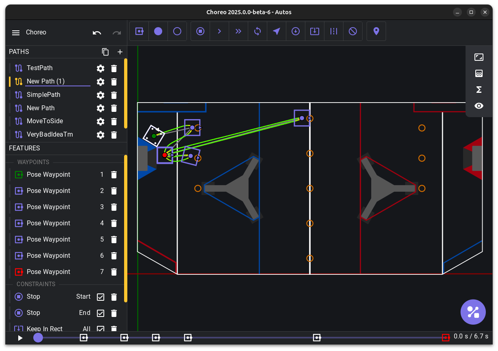

# Welcome

Welcome to the [Choreo](https://github.com/SleipnirGroup/Choreo) documentation.

[Get started](./installation.md){ .md-button .md-button--primary }

## What is Choreo?

Choreo (Constraint-Honoring Omnidirectional Route Editor and Optimizer, pronounced /koʊˈɹiːoʊ/, like K + "Oreo") is a graphical tool for planning time-optimized trajectories for autonomous mobile robots in the FIRST Robotics Competition.

-   :material-clock-fast:{ .lg .middle } __Accuracy__

    ---

    Each trajectory takes full advantage of the drivetrain's performance, while obeying its dynamics constraints.

-   :octicons-sparkle-fill-16:{ .lg .middle } __Easy UI__

    ---

    Easy to use graphical interface allowing real time playback.

-   :material-microsoft-windows:{ .lg .middle } :material-apple:{ .lg .middle } :fontawesome-brands-linux:{ .lg .middle } [__Cross Platform__](./installation.md)

    ---

    Choreo runs on Windows, macOS, and Linux.

-   :material-tune:{ .lg .middle } [__Customization__](./usage/editing-paths.md)

    ---

    Different types of **waypoints**, **constraints**, and **obstacles** along the path.

-   :material-library-shelves:{ .lg .middle } [__Vendor Installation__](./choreolib/installation.md)

    ---

    Robot-side vendor library installation.

-   :material-scale-balance:{ .lg .middle } [__Open Source__](./contributing/contributing-guide.md)

    ---

    Choreo is licensed under BSD-3-Clause, just like WPILib.

<!-- -   :material-connection:{ .lg .middle } __PathPlanner Integration__

    ---

    Integration with PathPlanner allows you to generate paths while still working with a familiar toolset. -->

## Safety

FRC robots are inherently dangerous, especially when operated at high speeds. Choreo is designed to enable users to operate their FRC robot at the very limits of its physical capabilities.

When using Choreo, operators should consider the following best practices to maximize their safety and the safety of their teammates. See the [FIRST Safety Manual](https://www.firstinspires.org/robotics/frc/safety) for additional guidance.

- Test in an area free of safety hazards and surrounded by physical barriers. Control the entry of people into the barricaded test area.
- Use a well-functioning Driver Station and be ready to disable the robot at all times when testing.
- Ensure your robot has a Robot Signal Light installed, functional, and visible from all directions. Teach all teammates how to determine the robot's enabled state based on the RSL.
- In a voice loud enough to hear, announce to bystanders your intent to enable the robot. Never enable the robot when people are in the test area, even if you think they are clear of the robot's expected path.
- Continue to control access to the testing area. When additional people arrive to the workspace, tell them about the hazards present.

!!! tip

    Be humble. Start small by planning a simple but meaningful trajectory, and convince yourself that the robot behaves as expected before attempting a more complex path.

As stated in our BSD 3-clause [License](https://github.com/SleipnirGroup/Choreo/blob/main/LICENSE), Choreo is provided "as-is" with no warranty intended or implied. By using this software, you:

- Acknowledge an understanding of the risks involved with controlling experimental, high-powered autonomous robots with experimental, high-powered software.
- Accept the responsibility for ensuring your safety and the safety of others around you.
- Agree to hold us harmless and not liable for any damage or loss.
