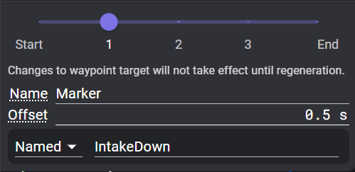

Choreo finds the [mathematically optimal](https://en.wikipedia.org/wiki/Mathematical_optimization) trajectory that passes through your waypoints, subject to your drivetrain's constraints. It also allows fine-grained customization while still maintaining concrete stability. This allows for smoother paths and better odometry.

## Waypoints

Waypoints are an ordered position that you'd like to hit on your path. There are multiple types of waypoints based on what you'd like to constrain in your path.

To add a waypoint, select the type of waypoint from the waypoints navbar on the top to get started, then click on the field where you want it. Your waypoints will show up on the sidebar. A yellow dot represents the currently selected waypoint, green for the starting waypoint, and red for the ending waypoint.

To change the type of an existing waypoint, use the options on the waypoint configuration panel, under the X, Y, and θ 
!!! tip
    Use the keys `1`, `2`, and `3` to select the pose, translation, and empty waypoints for adding.

### Pose Waypoints

Pose Waypoint is the first button on the waypoints navbar and consists of a translation **and** a rotation. This signifies that at this waypoint, the robot's translation and heading exactly match the waypoint. 

Drag the little triangle to change the heading. The robot faces in the direction the triangle is pointing.

- **X and Y**: position from the bottom left corner of the field (origin)
- **θ**: Robot heading, with 0 to the right (towards the positive field X)

### Translation Waypoints

Translation Waypoint is the second button on the waypoints navbar and consists of a translation but not a rotation. Use this waypoint if the robot's heading is driven by a different constraint, or if it should be left up to the optimizer.

- **X and Y**: position from the origin
- **θ**: Not used, but shows the heading as if the waypoint was a Pose Waypoint.

### Empty Waypoint

Empty Waypoint is the third button on the waypoints navbar. It does not directly constrain translation or rotation. However, other constraints such as Keep-In or Point-At can apply to it. It is also used to form the initial shape of the path around obstacles.

- **X and Y**: position from the origin
- **θ**: Not used, but shows the heading as if the waypoint was a Pose Waypoint.

## Constraints

Constraints are limitations that the optimizer needs to respect while generating a path.

These are applied in addition to the waypoints, and can sometimes conflict with the waypoints or each other. In some cases, Choreo will detect conflicts and fail generation early with a warning.

### Scopes

Different constraints can be applied in different scopes or ranges of the trajectory.

#### Waypoint Scope

Applies this constraint at the selected waypoint.

#### Segment Scope

Applies this constraint to the range of the trajectory between two waypoints, including the end waypoints.

#### Waypoint + Segment Scope

Some constraints can be applied to both individual waypoints and segments.

### List of Constraints

From left to right:

1. **Stop Point** (Waypoint): Constrains linear and angular velocity to 0 at the waypoint.
2. **Max Velocity** (Both): Limits the maximum chassis velocity throughout the scope.
    * Max Velocity equal to 0 on a segment will cause a generation failure.
3. **Max Acceleration** (Both): Limits the maximum chassis acceleration throughout the scope.
4. **Max Angular Velocity** (Both): Limits the maximum chassis angular velocity throughout the scope.
    * Max Angular Velocity equal to 0 with multiple Pose waypoints in the scope will fail with a warning, even if the Pose headings are identical
    * Max Angular Velocity equal to 0 with one Pose waypoint and some Translation or Empty waypoints can be used instead.

The following 5 constraints all have draggable shapes on the field tied to their configuration, which are visible when the constraint is selected in the sidebar. These shapes generally appear in the lower left corner of the field when the constraint is added.

5. **Point At** (Both): Forces the the robot to face its front or back to a given point, within a given tolerance.
    * When added, a target shape appears at (0,0) and can be moved to the desired facing point.
    * Any Pose waypoint within the scope of this constraint will fail with a warning.
6. **Keep In Circle** (Both): Keeps all corners of the bumpers inside the circle. 
    * Be mindful of small regions or waypoints close to the edge of the region, as they can easily cause constraint conflicts.
7. **Keep In Rectangle** (Both): Keeps all corners of the bumpers inside the rectangle.
    * A Keep In Rectangle matching the field wall dimensions is added by default on every new path.
8. **Keep In Lane** (Segment): Keeps the **center** of the robot within a given distance of the line between the two end waypoints.
    * This is used primarily to make the robot go in a mostly straight line.
    * If there are intermediate waypoints, the lane still goes straight between the start and end of the constraint range.
9. **Keep Out Circle** (Both): Keep all portions of the bumper outside of the circle.
    * See "Keep Out Regions" below.

### Adding Constraints

To add a constraint, select it from the top navbar. Click the waypoint at one end of the constraint's range. For Segment scope constraints, a dashed line will follow your cursor. If you hover over another waypoint, the line will go through all the waypoints in the range. Click the second waypoint to add the constraint.

> NOTE: If adding a Waypoint + Segment scope constraint to a single waypoint, you will have to click the same waypoint twice.

### Constraint Display

When a constraint is selected in the sidebar, circles and dashed lines will show the range of waypoints under the constraint.

Some constraints have field points or regions associated with them. When these constraints are selected, the field will display movable points and shapes to define these regions.

## Keep Out Regions

Keep out regions force the robot to avoid a certain area of the field throughout the path. For example, in the 2023 Charged Up game, you might want to avoid crashing into the charge station. Keep out constraints makes it easy to define where you want the robot to start and end without unnecessary (and performance-impacting) intermediary waypoints.

!!! warning
    Keep Out Regions can cause weird behaviours when generating paths due to known issues with the numerical solver used for Choreo. This can be avoided using intermediary waypoints, and/or by scoping the constraint to only the portion of the trajectory that might collide.

To add a keep out circle:

1. Select the keep out circle from the navbar (looks like a circle with a slash through it).

2. Add the constraint to the desired range. After selecting the endpoints, a red circle will appear in the lower left corner of the field.
3. Move and resize the circle to the desired location. Drag the center dot to move it, and drag the outer edge to resize it. You can also use the constraint configuration panel on the top left of the field to edit the center x, center y, and circle radius.

## Event Markers

For teams that use the PathPlannerLib interoperability to follow Choreo paths, Choreo offers event marker support to trigger commands during the path.

Event markers in Choreo are placed based on time offset before/after a specified waypoint. Add a marker by selecting the event marker on the navbar and clicking on the targeted waypoint. The target can be changed similarly to a constraint.

When the trajectory is (re)generated, the marker will appear at the proper timestamp and be exported to the .traj file.

Changes to the time offset will reflect in the .traj file immediately, relative to the timestamp of the targeted waypoint as of the last generation.
!!!tip You can see the waypoints as they were in the last generation by turning on the "Samples" view layer. You can then turn off "Waypoints" if the current waypoints obstruct the small waypoints from the "Samples" layer.

Changes to the targeted waypoint will not reflect until trajectory regeneration.

Changes to the marker name are not part of the trajectory, so will not trigger updates to the .traj file.

The options for binding commands to markers mirror PathPlanner's functionality. Named commands use the same registry of names that PathPlanner markers use. However, there is currently no autofill menu with the existing command names. Changes to the command reflect immediately in the .traj.

There are a few reasons why event markers might not export. These will be shown with a **!** next to the marker in the sidebar.

1. There is a stop point (including the path endpoints) between the targeted waypoint and the marker's actual timestamp.
2. The marker targets a waypoint that has been deleted. You need to select another waypoint in the marker config panel.
3. The path had been modified between the last generation and adding the marker, so Choreo can't give the marker a proper timestamp. Regenerate the path.

## Generating

You can create paths by chaining waypoints together. Check out [Controls & Shortcuts](./controls-shortcuts.md) for advanced controls. Once you have at least two waypoints, then you can generate a path.

!!! tip
    You can cancel the path generation by pressing control and clicking the red "X" once it has started.

!!! tip
    If there is an error generating a path, check to make sure your waypoints can physically work.

!!! tip
    If there is an error generating a path, check to make sure your config units are correct.

