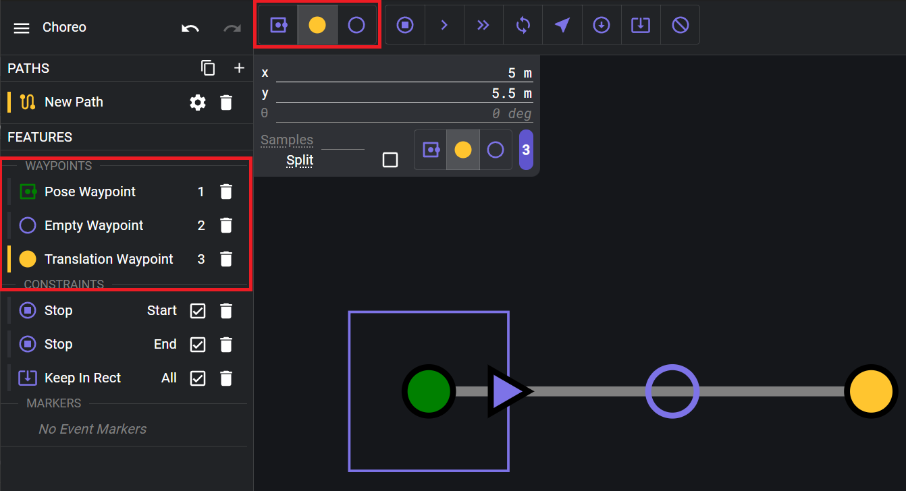
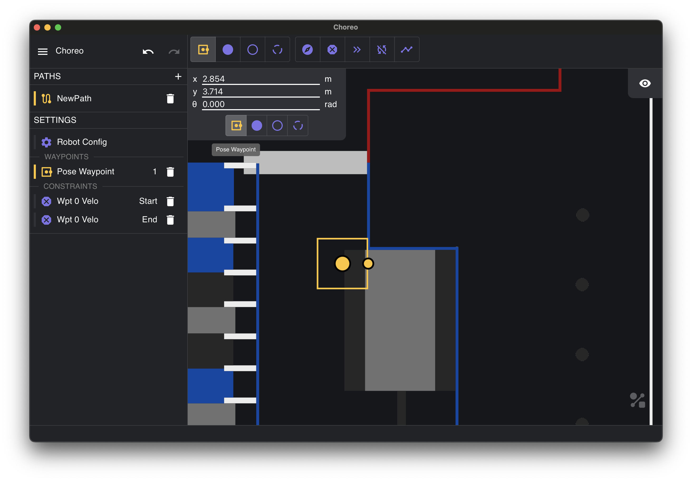

Choreo finds the [mathematically optimal](https://en.wikipedia.org/wiki/Mathematical_optimization) trajectory that passes through your waypoints, subject to your drivetrain's constraints. It also allows fine-grained customization while still maintaining concrete stability. This allows for smoother paths and better odometry.

## Waypoints

Waypoints are an ordered position that you'd like to hit on your path. There are multiple types of waypoints based on what you'd like to constrain in your path.

To add a waypoint, select the type of waypoint from the waypoints navbar on the top to get started, then click on the field where you want it. Your waypoints will show up on the sidebar. A yellow dot represents the currently selected waypoint, green for the starting waypoint, and red for the ending waypoint.

### Pose Waypoints

Pose Waypoint is the first button on the waypoints navbar and consists of a translation **and** a rotation. Drag the little yellow circle (outlined in black) to change the heading.

- **X and Y**: position in meters from the bottom left (origin)
- **θ**: Angular offset in radians -π to π, 0 to right

### Translation Waypoints

Translation Waypoint is the second button on the waypoints navbar and consists of a translation but not a rotation. The UI still includes the yellow circle, but is only stored to be able to convert later into a Pose Waypoint. However, rotation is still used as part of the initial guess.

- **X and Y**: position in meters from the bottom left (origin)

### Empty Waypoint

Empty Waypoint allows you to apply a constraint somewhere along a segment without putting a position or heading constraint at that waypoint, similar to constraints.

## Initial Guess Point

The initial guess waypoint just affects the straight-line-between-waypoints gray line, which is used as the starting point for optimization. (Until obstacles are added, this doesn’t have much effect.)

## Constraints

Constraints are limitations that the optimizer needs to respect while generating a path. Different constraints can be applied in different scopes or ranges.

### Waypoint Scope

Applies this constraint between at that specific waypoint.

### Segment Scope

Applies this constraint between waypoints. Intuitively, this constrains your trajectory to be a straight line between two waypoints.

### Waypoint + Segment Scope

Like a segment scope, but including segments (intuitive example: think of zero angular velocity)

| Name                        | Description                                                                                                                                                                                                                                          | Waypoint Scope | Segment Scope |
| --------------------------- | ---------------------------------------------------------------------------------------------------------------------------------------------------------------------------------------------------------------------------------------------------- | -------------- | ------------- |
| Waypoint Velocity Direction | Constrains the robot's direction of travel at a waypoint.                                                                                                                                                                                            | Yes            | No            |
| Waypoint Zero Velocity      | Stop at a certain point                                                                                                                                                                                                                              | Yes            | No            |
| Max Velocity                | Constrains the max velocity to a specific value throughout multiple waypoints/segments This generally refers to the Maximum Velocity of robot chassis in m/s. A default value can be defined in Robot Config ([Getting Started](../document-settings/robot-configuration.md)) | Yes            | Yes           |
| Zero Angular Velocity       | Ensures zero angular velocity through the waypoint and/or segment scope.                                                                                                                                                                             | Yes            | Yes           |
| Straight Line               | Tells the solver to draw a straight line as the path between two immediate waypoints.                                                                                                                                                                | No             | Yes           |

## Obstacles

Obstacles force the robot to avoid a certain area of the field throughout the path. For example, in the 2023 Charged Up game, you might want to avoid crashing into the charge station. Obstacles makes it easy to define where you want the robot to start and end without unnecessary (and performance-impacting) intermediary waypoints.

To add a circle obstacle:

1. Select the circle obstacle from the navbar (looks like a circle with a slash through it).
2. Select anywhere on the field to add an obstacle. You can click on the ends of the circle to resize them. You can also use the info panel on top left of the field to edit the center x, center y, and circle radius.

## Generating

You can create paths by chaining waypoints together. Check out [Controls & Shortcuts](./controls-shortcuts.md) for advanced controls. Once you have at least two waypoints, then you can generate a path.

!!! tip
    You can cancel the path generation by pressing control and clicking the red "X" once it has started.

!!! tip
    If there is an error generating a path, check to make sure your waypoints can physically work.

