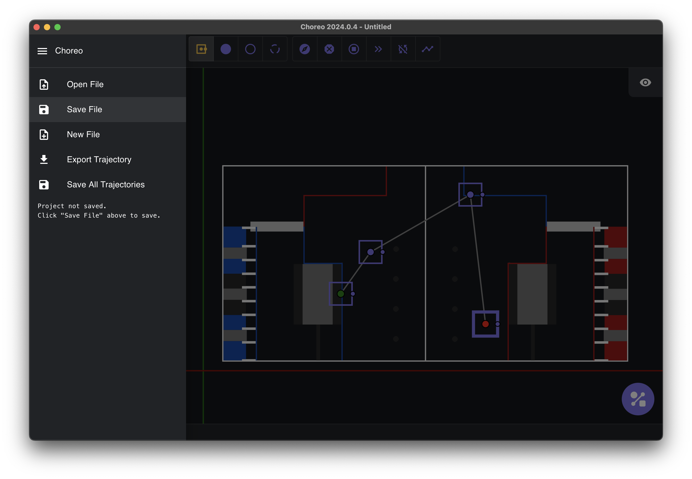
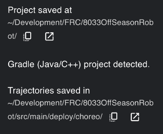
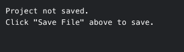

# Saving

Once trajectories are created by Choreo, they must be saved within your robot project.

Choreo has 2 different kinds of files: a .chor file which stores general configs for your project,
and multiple .traj files which store individual path information. Each .traj file correlates to one path in Choreo. Choreo generates and updates .traj files
in the same directory (or folder) that your .chor file is stored in.

## Saving your .chor file (Save Project)

Path following libraries, such as ChoreoLib and PathPlannerLib, require your .traj files to be located
in a specific directory so that they can be read. Choreo will place .traj files adjacent to the .chor, so the save location of the .chor is important.

### For Java and C++ teams:

1. Create a `choreo` folder within the `src/main/deploy` folder of your robot project.
2. Open the Choreo sidebar and click "Save Project"(see "Sidebar Navigation" for more details).
3. Navigate to the location of your robot project and find the `src/main/deploy/choreo` folder within it.
4. Name your .chor file whatever you want.

### For Python teams:

1. Create a `deploy/choreo` folder within the root folder of your robot project.
2. Open the Choreo sidebar and click "Save Project" (see "Sidebar Navigation" for more details).
3. Navigate to the location of your robot project and find the `deploy/choreo` folder within it.
4. Name your .chor file whatever you want.

## Sidebar Navigation

To access the sidebar, click the hamburger icon in the upper left corner.

General Info:

In the sidebar, there are four actions related to saving your project, along with your project's current save location.

## Open Project

This opens the system’s file select dialog to select the robot’s `.chor` file.

## Save Project/Save Project As

This opens the system’s file save dialog to select where to save the robot’s `.chor` file.

## New Project

Creates a new unsaved project.

## Export Diagnostic Report

This exports a .zip file with your project `.chor` and `.traj` files, as well as some logs. Choreo support may ask for this report when trying to help you.

## Project Details

If you have saved your choreo file correctly, you should see the following:

Below "Project saved at", you can see the directory in which the project files live. You can also copy this path or open it in your system's file explorer.

!!! warning

    If you get the below, it means you have not saved the file yet.

     {: style="height:60px;"}

# Folder Structure Example

For C++ and Java teams:

- Choreo file lives at: `~/Development/FRC/Robot/src/main/deploy/choreo/ChoreoProject.chor`
- Trajectories (`.traj`) live in: `~/Development/FRC/Robot/src/main/deploy/choreo/...`

For Python teams:

- Choreo file lives at: `~/Development/FRC/Roboto/ChoreoProject.chor`
- Trajectories (`.traj`) live in: `~/Development/FRC/Roboto/...`
