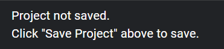

# Saving

To access the sidebar, click the hamburger icon in the upper left corner.

General Info:

- Choreo’s file saving mechanism ties into a WPILib robot root directory, wherein a single `.chor` file lives in the project’s root folder.

In the sidebar, there are five actions related to saving your project, along with your project's current save location.

## Open File

This opens the system’s file select dialog to select the robot’s `.chor` file. This should already be in your robot project root folder.

## Save File

This opens the system’s file save dialog to select where to save the robot’s `.chor` file. Choreo strongly recommends saving this file in your robot project root folder.

## New File

Creates a new file in memory, essentially clearing all trajectories. If you have unsaved changes, Choreo will ask before clearing them.

## Export Trajectory

Exports the trajectory as a file individually to the path you select in the UI. This is not tied with the robot project structure, so you can place the trajectory file anywhere you like.

## Save All Trajectories

This saves all the trajectories into the folder structure described below.

## Project Details

If you have saved your choreo file correctly, you should see the following:

Below "Project saved at", you can see the directory in which the saved `.chor` file lives. You can also copy this path or open it in your system's file explorer.

If you see "Gradle project detected," then there is a `.gradle` file as well as a `src/main/deploy` directory in which to save trajectories.

Below "Trajectories saved in," you can see the path in which trajectories are saved.
Trajectories saved in shows relative path where trajectories are saved in. [ChoreoLib](../choreolib/installation.md) looks for trajectories in `{deployDirectory}/choreo`.
   
If you get the below:

Then it means you have not saved the file yet.

 
# Folder Structure
Example:

- Choreo file lives in: `~/Development/FRC/Roboto/Choreo.chor`
- Trajectories live in: `~/Development/FRC/Roboto/src/main/deploy/choreo/...`
