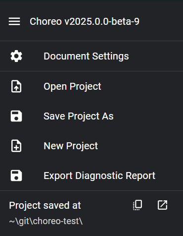

# Saving

Once trajectories are created by Choreo, they must be saved within your robot project.

Choreo has 2 different kinds of files: a .chor file which stores general configs for your project,
and multiple .traj files which store individual trajectories. Choreo generates and updates .traj files
in the same directory (or folder) that your .chor file is stored in.

## Saving your .chor file

Path following libraries, such as ChoreoLib and PathPlannerLib, require your .traj files to be located
in a specific directory so that they can be read. For Java and C++ teams, .traj files must be placed under
the `deploy/choreo` directory; for Python teams, they must be placed in the root directory.

### For Java and C++ teams:

1. Create a `choreo` folder within the `deploy` folder of your robot project.
   The deploy folder can be found under `src/main`.
2. Open the Choreo sidebar and click "Save Project"(see "Sidebar Navigation" for more details).
3. Navigate to the location of your robot project and find the `src/main/deploy/choreo` folder within it.
4. Name your .chor file whatever you want.

### For Python teams:

1. Open the Choreo sidebar and click "Save Project"(see "Sidebar Navigation" for more details).
2. Navigate to the location of your robot project and place your .chor file there.

## Sidebar Navigation

To access the sidebar, click the hamburger icon in the upper left corner.

General Info:

!!! note
Choreo’s file saving mechanism ties into a WPILib robot root directory, wherein a single `.chor` file lives in the project’s root folder.

In the sidebar, there are five actions related to saving your project, along with your project's current save location.

## Open File

This opens the system’s file select dialog to select the robot’s `.chor` file. This .chor file should be under the folders `src/main/deploy/choreo`
in your robot project.

## Save File

This opens the system’s file save dialog to select where to save the robot’s `.chor` file. Choreo strongly recommends saving this file in your `deploy/choreo` folder within your project.

## New File

Creates a new file in memory, essentially clearing all trajectories. If you have unsaved changes, Choreo will ask before clearing them.

## Export Trajectory

Exports the trajectory as a file individually to the path you select in the UI. This is not tied with the robot project structure, so you can place the trajectory file anywhere you like.

## Save All Trajectories

This saves all the trajectories into the folder structure described below.

## Project Details

If you have saved your choreo file correctly, you should see the following:

Below "Project saved at", you can see the directory in which the saved `.chor` file lives. You can also copy this path or open it in your system's file explorer.

!!! warning

    If you get the below, it means you have not saved the file yet

     {: style="height:60px;"}

# Folder Structure Example

For C++ and Java teams:

- Choreo file lives at: `~/Development/FRC/Roboto/src/main/deploy/choreo/ChoreoProject.chor`
- Trajectories (`.traj`) live in: `~/Development/FRC/Roboto/src/main/deploy/choreo/...`

For Python teams:

- Choreo file lives at: `~/Development/FRC/Roboto/ChoreoProject.chor`
- Trajectories (`.traj`) live in: `~/Development/FRC/Roboto/...`
