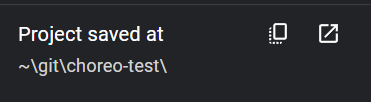

# Saving

To access the sidebar, click the hamburger icon in the upper left corner.

General Info:

- Choreo’s file saving mechanism ties into a WPILib robot root directory, wherein a single `.chor` file lives in the project’s root folder.

In the sidebar, there are five actions related to saving your project, along with your project's current save location.

## Open File

This opens the system’s file select dialog to select the robot’s `.chor` file. This should already be in your robot project root folder.

## Save File

This opens the system’s file save dialog to select where to save the robot’s `.chor` file. Choreo strongly recommends saving this file in your robot project root folder.

## New File

Creates a new file in memory, essentially clearing all trajectories. If you have unsaved changes, Choreo will ask before clearing them.

## Export Trajectory

Exports the trajectory as a file individually as the path selected in the UI. This is not tied with the robot project structure, rather for you to get the trajectory file.

## Save All Trajectories

This saves all the trajectories into the folder structure described below.

## Project Details

If you have saved your choreo file, correctly, you should see the below:

Project saved at shows the relative path where the `.chor` file lives in. You copy or open the full path in the default files app.

Gradle project detected looks for a .gradle file as well as `/src/main/deploy/`, so it can put the trajectories in.

Trajectories saved in shows relative path where trajectories are saved in. [ChoreoLib](../choreolib/installation.md) looks inside the `{deployDirectory}/choreo` for a matching trajectory.
   
If you get the below:

Then it means you have not saved the file yet.

 
# Folder Structure
Example:

- Choreo file lives in: `~/Development/FRC/Roboto/Choreo.chor`
- Trajectories live in: `~/Development/FRC/Roboto/src/main/deploy/choreo/...`
