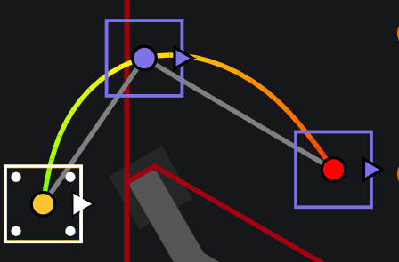

# View Options Panel

## Zoom to fit Trajectory

This zooms to fit the trajectory of the focused path. You can also access this option through the shortcut `Control + 0` or `Command + 0`

## Path Gradients
Path Gradients are colors displayed between intervals or between waypoints, depending on the specified behavior. This can be helpful for those trying to debug information quickly, or verify a constraint's effects.

### None
No path gradient applied. The gradient shows a solid yellow line throughout the path.

### Velocity (Default Option)
Faster robot velocity is shown as green.

### Progress
The start of the path is green, and it progressively gets more red towards the end of the path.
This color is consistent between waypoints.

### Acceleration
Faster robot acceleration is shown as green. This is calculated as a magnitude between the intervals.

### Interval ∆t
Shorter time difference between intervals is shown as green. In other words, closer intervals are shown as green, and further intervals progressively get closer to red.

### Angular Velocity
Faster robot angular velocity is shown as green. In other words, fast robot turns between intervals are shown with green.

### Split Trajectories
Split trajectories on stop points are shown in different colors. In other words, the split trajectories between stop points have unique colors. This can be a useful debugging tool/visual aid in understanding where the robot stops.

## Field Options

### Field

Shows the field svg overlay.

### Grid

Shows the grid overlay

### Trajectory

### Samples

### Waypoints

### Obstacles

Shows the obstacles in the path.

### Focus

Focuses the selected range of waypoints in the path. Note that the whole trajectory still shows if it is enabled since the trajectory is independent from the waypoints once generated by the solver.

